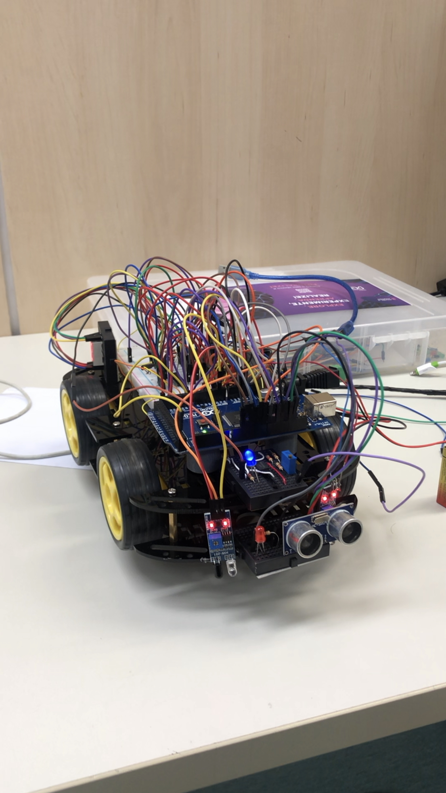
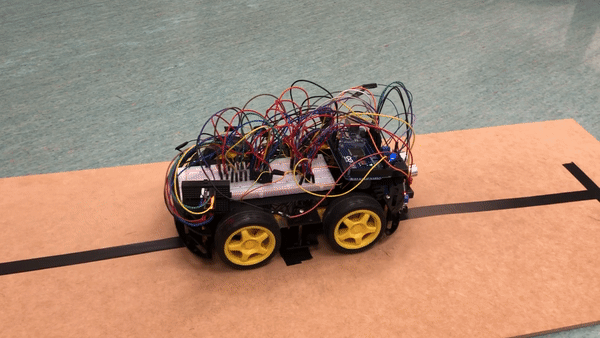

# Project - ELO 100 (Code)
>It's a code in [C++ Arduino](https://www.arduino.cc/reference/pt/) language. The program is basically for a following line Robot with a few more features.


<p align="center">
  The following line robot of my project<br><br>
  
</p>

## Prerequisites
* [IDE](https://www.arduino.cc/en/software)

## Installation

Mac OS X & Linux & Windows:

```sh 
You just need to download (or copy) the file "main.ino"
```

After this you just need to run with Arduino Compiler.

## The Code of the Project
> After you run the code, you have 12 seconds to put your following line Robot on the track.
<p align="center">
   
</p>

### Functions
#### 1 - Turn right
> The right line follower sensor does not detect light ("detects black line"), stopping the right motors thus only the left motors will remain active.<br>

<p align="center">

</p>

#### 2 - Turn left
> The left line follower sensor does not detect light ("detects black line"), stopping the left motors thus only the right motors will remain.<br>

<p align="center">

</p>

#### 3 - Stops

> Both line follower sensors do not detect light ("detects a perpendicular black line") thus stopping and counting 8 seconds (appears on display - 8,7,6,5,4,3,2,1).<br>

<p align="center">

</p>

#### 4 - Emergency Stop

> When there's an obstacle on the track the ultrasonic sensor will detect and stop all the motors until this obstacle is removed from the track.<br>

<p align="center">

</p>

## Updates

* 1.0.1
    * ADD: README and folder IMGS/GIF
* 1.0.0
    * ADD: .gitignore and .gitattribute
    * First stable release


## Meta
This project is based on the Energy and Mobility megatrend (I has a post in [Youtube](https://youtu.be/THYwwkqnKmc) to explain all the project is about). 

Guided  by the professor [@Rudolf_Buhler](https://br.linkedin.com/in/rtbuhler) on ELO100 subject in the [University Center of FEI](https://portal.fei.edu.br/)

<br>

Danilo Barbosa - [@bdanilo_](https://www.instagram.com/bdanilo_/) - Mechanics

Massiel Blandy - [@massiblandy](https://www.instagram.com/massiblandy/) - Eletronics

Lucas Lagoeiro - [@DevLagoeiro](https://twitter.com/DevLagoeiro) - devlagoeiro@outlook.com - Software
<br><br> 

[https://github.com/LucasLagoeiro](https://github.com/LucasLagoeiro)
